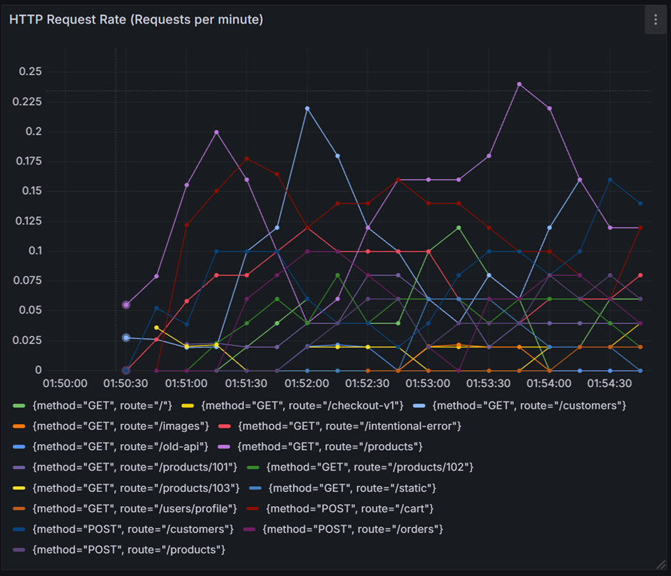
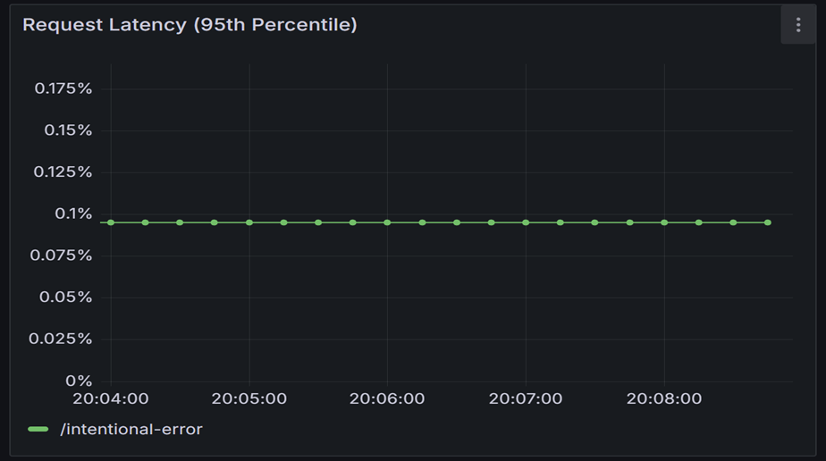
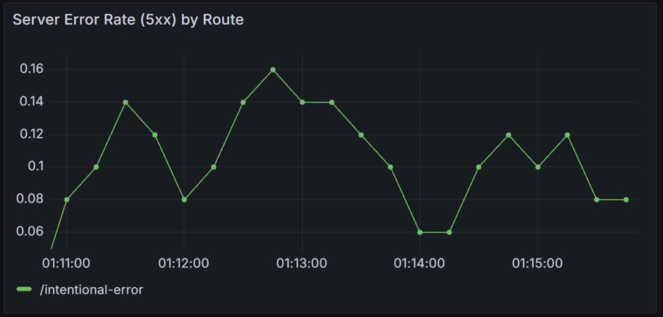
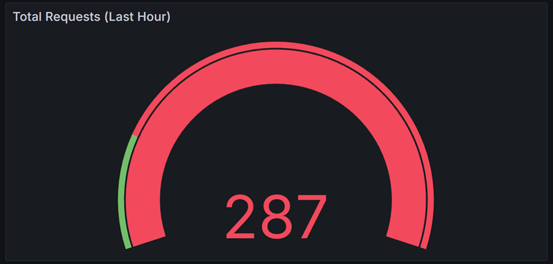
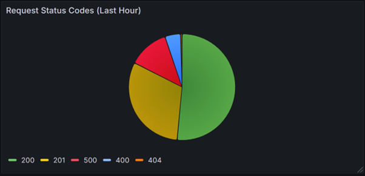

# Monitored API Server

A comprehensive development of a Node.js API server for a mock electronics store, complete with a full DevOps monitoring and alerting stack using Prometheus, Grafana, and Alertmanager.

This project showcases:
*   Custom API development with Node.js and Express.js.
*   Instrumentation of an application to expose custom metrics using `prom-client`.
*   Configuration and operation of Prometheus for metrics scraping and storage.
*   Creation of insightful dashboards in Grafana for real-time visualization.
*   Implementation of alert rules in Prometheus and handling by Alertmanager.

---

## Table of Contents

*   [Features](#features)
*   [Technology Stack](#technology-stack)
*   [Project Structure](#project-structure)
*   [Prerequisites](#prerequisites)
*   [Setup and Running the Project](#setup-and-running-the-project)
    *   [1. API Server Setup](#1-api-server-setup)
    *   [2. Prometheus Setup](#2-prometheus-setup)
    *   [3. Alertmanager Setup](#3-alertmanager-setup)
    *   [4. Grafana Setup](#4-grafana-setup)
    *   [Running the Full Stack](#running-the-full-stack)
*   [Accessing the Services](#accessing-the-services)
*   [Generating Traffic & Triggering Alerts](#generating-traffic--triggering-alerts)
*   [Key Metrics Exposed](#key-metrics-exposed)
*   [Example Dashboards & Alerts](#example-dashboards--alerts)
*   [Future Enhancements](#future-enhancements)
*   [Contributing](#contributing)
*   [Contact](#contact)

---

## Features

*   **Electronics Store API:**
    *   Endpoints for managing customers and products (GET, POST).
    *   Endpoints simulating e-commerce actions: viewing product details, adding to cart, placing orders.
    *   In-memory data storage for simplicity.
*   **Metrics Instrumentation:**
    *   Standard HTTP metrics (request count, latency, error codes).
    *   Custom e-commerce specific metrics (product views, items added to cart, orders placed, inventory levels).
*   **Prometheus Monitoring:**
    *   Configuration to scrape metrics from the API server.
    *   Storage of time-series data.
*   **Grafana Visualization:**
    *   Connection to Prometheus as a data source.
    *   Dashboards with 5-6 insightful graphs visualizing key performance indicators.
*   **Alertmanager Implementation:**
    *   Definition of an alert rule (e.g., high server error rate).
    *   Integration with Prometheus to receive and display alerts.

---

## Technology Stack

*   **Backend API:** Node.js, Express.js
*   **Metrics Library:** `prom-client` (for Node.js)
*   **Metrics Collection & Storage:** Prometheus
*   **Visualization:** Grafana
*   **Alerting:** Alertmanager
*   **Operating System (for this setup):** Windows (but concepts are platform-agnostic)
*   **API Testing:** Postman / cURL

---

## Project Structure

The project is organized as follows:

*   **`.`** (Root Directory)
    *   **`api-server/`**: Contains all application code, configurations, and runtime data.
        *   **`node_modules/`**: Directory for Node.js project dependencies (managed by npm, ignored by Git).
        *   **`data/`**: Runtime data generated by Prometheus and Alertmanager (e.g., metrics, alert states). This directory should be added to `.gitignore`.
        *   **`.gitignore`**: Specifies intentionally untracked files that Git should ignore (e.g., `node_modules/`, `data/`).
        *   **`alert.rules.yml`**: Defines alert rules for Prometheus.
        *   **`alertmanager.yml`**: Configuration file for Alertmanager.
        *   **`package-lock.json`**: Records exact versions of npm dependencies.
        *   **`package.json`**: Defines project metadata, dependencies, and scripts.
        *   **`prometheus.yml`**: Configuration file for Prometheus.
        *   **`server.js`**: The main Node.js Express application file containing the API logic and metrics instrumentation.
* **`Images/`:** Contains image files used within the project documentation or other relevant contexts.
    * `http_request_rate.png`
    * `http_status_codes.png`
    * `p95_latency.png`
    * `server_error_rate.png`
    * `top_5_routes.png`
    * `total_requests.png`
*   **`generate_electronics_traffic.sh`**: Bash script to generate varied load against the API for testing.
*   **`README.md`**: This file, providing an overview and instructions for the project.

---

## Prerequisites

Before you begin, ensure you have the following installed on your Windows system:

1.  **Node.js and npm (LTS Recommended):** [Download Node.js](https://nodejs.org/)
    *   Verify: `node -v` and `npm -v`
2.  **Git for Windows:** [Download Git](https://git-scm.com/download/win) (provides Git Bash, which includes `curl`)
    *   Verify: `git --version`
3.  **Prometheus:** [Download Prometheus](https://prometheus.io/download/) (Windows `amd64` .zip)
4.  **Alertmanager:** [Download Alertmanager](https://prometheus.io/download/) (Windows `amd64` .zip)
5.  **Grafana:** [Download Grafana](https://grafana.com/grafana/download/) (Windows Installer `.msi` recommended)
6.  **Text Editor/IDE:** VS Code is recommended.
7.  **(Optional) API Client:** Postman or be comfortable with `curl`.

---

## Setup and Running the Project

### 1. API Server Setup

1.  **Clone the repository (if you haven't already):**
    ```bash
    git clone https://github.com/[YourGitHubUsername]/[YourRepoName].git
    cd [YourRepoName]/api-server
    ```
2.  **Install Node.js dependencies:**
    ```bash
    npm install
    ```
    The `server.js` file is already configured with metrics.

### 2. Prometheus Setup

1.  **Extract Prometheus:** Create a directory (e.g., `D:\DevOps_Tools\Prometheus`) and extract the Prometheus `.zip` contents there.
2.  **Configuration Files:** The necessary `prometheus.yml` and `alert.rules.yml` are already included in the `api-server` directory of this repository. You will point Prometheus to use these.

### 3. Alertmanager Setup

1.  **Extract Alertmanager:** Create a directory (e.g., `D:\DevOps_Tools\Alertmanager`) and extract the Alertmanager `.zip` contents there.
2.  **Configuration File:** The `alertmanager.yml` file is included in the `api-server` directory.

### 4. Grafana Setup

1.  **Install Grafana:** Run the Grafana `.msi` installer. It will typically install as a Windows service.
2.  **Initial Login & Password Reset (if needed):**
    *   Access Grafana at `http://localhost:3000`.
    *   Default credentials are `admin`/`admin`. You'll be prompted to change the password.
    *   If you forget your password, stop Grafana, open an administrative terminal, navigate to `C:\Program Files\GrafanaLabs\grafana\bin` (or your install path) and run:
        ```powershell
        .\grafana-cli.exe admin reset-admin-password YourNewStrongPassword
        ```
    *   Restart Grafana.
3.  **Add Prometheus Data Source:**
    *   In Grafana: Configuration (gear icon) -> Data Sources -> Add data source -> Prometheus.
    *   **Name:** `Prometheus` (or similar)
    *   **URL:** `http://localhost:9090`
    *   Click "Save & test". You should see a success message.

---

### Running the Full Stack

You will need to run each component in a separate terminal window.

1.  **Start the Node.js API Server:**
    *   Open a terminal, navigate to the `api-server` directory.
    *   Run: `node server.js`
    *   *Expected Output:* Server listening on `http://localhost:5000`, metrics on `http://localhost:5000/metrics`.

2.  **Start Prometheus:**
    *   Open a *new* terminal.
    *   Run Prometheus, pointing to the configuration file in your `api-server` project directory:
        ```bash
        # Adjust D:\DevOps_Tools\Prometheus to your Prometheus executable path
        # Adjust D:\path\to\your\project\api-server to your project path
        D:\DevOps_Tools\Prometheus\prometheus.exe --config.file="D:\path\to\your\project\api-server\prometheus.yml" --storage.tsdb.path="D:\path\to\your\project\api-server\data\prometheus"
        ```
        *   **Note:** The `--storage.tsdb.path` flag is crucial if `prometheus.yml` is not in the same directory as `prometheus.exe`, to ensure data is stored within your project structure (and can be gitignored). If `prometheus.yml` (and thus the `data` folder) is in the same directory where you run `prometheus.exe`, this flag might not be strictly necessary as it defaults to `./data`. For clarity and consistency when configs are separate, it's good to specify. Ensure the `api-server/data/prometheus` path exists or Prometheus can create it.

3.  **Start Alertmanager:**
    *   Open a *new* terminal.
    *   Run Alertmanager, pointing to its configuration file:
        ```bash
        # Adjust D:\DevOps_Tools\Alertmanager to your Alertmanager executable path
        D:\DevOps_Tools\Alertmanager\alertmanager.exe --config.file="D:\path\to\your\project\api-server\alertmanager.yml" --storage.path="D:\path\to\your\project\api-server\data\alertmanager"
        ```
        *   **Note:** Similarly, use `--storage.path` for Alertmanager data.

4.  **Ensure Grafana is Running:**
    *   If installed as a service, it should be running. Check `Services.msc`.
    *   If run manually, ensure `grafana-server.exe` is executing.

---

## Accessing the Services

*   **API Server:** `http://localhost:5000`
*   **API Metrics:** `http://localhost:5000/metrics`
*   **Prometheus UI:** `http://localhost:9090`
*   **Alertmanager UI:** `http://localhost:9093`
*   **Grafana UI:** `http://localhost:3000`

---

## Generating Traffic & Triggering Alerts

Use the `generate_electronics_traffic.sh` script (provided in this repository, or adapt it) in Git Bash to send varied requests to the API.

1.  **Ensure the script is executable:**
    ```bash
    chmod +x generate_electronics_traffic.sh
    ```
2.  **Run the script from the `api-server` directory (or wherever you placed it):**
    ```bash
    ./generate_electronics_traffic.sh
    ```

This script is designed to hit various endpoints, including `/intentional-error`, which should trigger the `HighApiErrorRate` alert after sustained 5xx errors (as defined by `for: 1m` in `alert.rules.yml`). Observe your Grafana dashboards and Prometheus/Alertmanager UIs while the script is running. Press `Ctrl+C` in the Git Bash window to stop the script.

---

*Caption: Overview of the Grafana dashboard visualizing API performance and e-commerce metrics.*


**Alert Firing Example:**

The `HighApiErrorRate` alert is configured in `alert.rules.yml` and managed by Alertmanager. It is designed to fire if more than 5% of requests to the API result in a 5xx (server-side) error over a 2-minute period, for a sustained duration of at least 1 minute. This can be tested by repeatedly hitting the `/intentional-error` endpoint.
*The `HighApiErrorRate` alert shown as 'FIRING' in the Prometheus or Alertmanager UI after intentionally triggering server errors.*

---

## Key Metrics Exposed

The `server.js` in this project exposes several key metrics for monitoring:

*   **`http_requests_total`**: A counter for the total number of HTTP requests, labeled by:
    *   `method` (e.g., GET, POST)
    *   `route` (e.g., /products, /cart)
    *   `code` (e.g., 200, 404, 500)
*   **`http_request_duration_seconds`**: A histogram measuring the latency of HTTP requests, also labeled by `method`, `route`, and `code`.
*   **`electronics_product_detail_views_total`**: A counter for views of specific product detail pages, labeled by `productId`, `category`, and `brand`.
*   **`electronics_items_added_to_cart_total`**: A counter for items added to the shopping cart, labeled by `productId` and `category`.
*   **`electronics_orders_placed_total`**: A counter for successfully placed orders.
*   **`electronics_inventory_level`**: A gauge representing the current stock level for products, labeled by `productId`, `category`, and `brand`.

---

## Example Dashboards & Alerts

### 1. HTTP Request Rate (Requests per minute)
Displays the per-minute average rate of incoming requests, broken down by API route and HTTP method. Helps identify the busiest endpoints, detect traffic surges or drops, and understand usage patterns.




### 2. P95 Request Latency by Route
Shows the 95th percentile latency (the time within which 95% of requests completed) for each route. Crucial for understanding worst-case performance experienced by users and identifying slow endpoints needing optimization. Unit set to seconds.




### 3. Server Error Rate (5xx) by Route
Tracks the rate of server-side errors (HTTP status codes 500-599) per route. Essential for quickly detecting backend problems affecting specific API functionalities.




### 4. Total Requests (Last Hour)
Provides a single statistic showing the total number of requests received over the selected period (e.g., last hour). Useful for a high-level overview of application load.




### 5. Top 5 Routes (Last Hour)
Identifies the most frequently requested API routes over the selected period. Helps focus optimization efforts and understand which parts of the API are most used.


### 6. Request Status Codes (Last Hour)
Visualizes the distribution of HTTP status codes (2xx, 4xx, 5xx) across all requests. Provides a quick health check – a large slice of 5xx or 4xx codes indicates widespread issues.



## Future Enhancements

This project serves as a strong foundation. Potential future enhancements include:

*   **Dockerization:** Containerize all services (API server, Prometheus, Grafana, Alertmanager) using Docker and Docker Compose for improved portability, consistency, and ease of deployment.
*   **Persistent Storage:** Configure robust persistent storage for Prometheus time-series data and Grafana configurations (dashboards, users, data sources), especially when moving towards a production-like environment.
*   **Advanced Alerting & Notifications:**
    *   Implement more sophisticated alert rules (e.g., low inventory alerts, high cart abandonment rate, specific business KPI thresholds).
    *   Configure Alertmanager to route alerts to actual notification channels (e.g., Email, Slack, PagerDuty).
*   **CI/CD Pipeline:** Integrate the project with a CI/CD pipeline (e.g., GitHub Actions, Jenkins) for automated building, testing, and potentially deployment of the API server and monitoring configurations.
*   **API Security:** Implement authentication (e.g., JWT) and authorization mechanisms for the API endpoints.
*   **Database Integration:** Replace the in-memory data storage with a persistent database (e.g., PostgreSQL, MongoDB) for the API server.
*   **Distributed Tracing:** If the API were to evolve into microservices, integrating distributed tracing (e.g., Jaeger, Zipkin) would be a valuable addition for end-to-end request visibility.
*   **Log Management:** Complement metrics with a centralized logging solution (e.g., ELK Stack, Loki).

---

## Contributing

Contributions, issues, and feature requests are welcome!

1.  Fork the Project
2.  Create your Feature Branch (`git checkout -b feature/AmazingFeature`)
3.  Commit your Changes (`git commit -m 'Add some AmazingFeature'`)
4.  Push to the Branch (`git push origin feature/AmazingFeature`)
5.  Open a Pull Request

---

## Contact

Harsh Deep - [LinkedIn](https://www.linkedin.com/in/harshdeep7199/) - [Email](harshdeep7199@gmail.com)

Project Link: [https://github.com/TheDeepDelve/API-Server](https://github.com/TheDeepDelve/API-Server)
